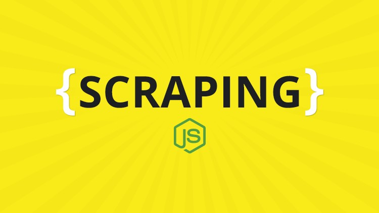

  

# Learn Web Scraping with NodeJs in 2019 - The Crash Course

- **Instructors**: Grohs Fabian
- **Length**: 7.0 hr
- **Link**: [Udemy | Learn Web Scraping with NodeJs in 2019 - The Crash Course](https://www.udemy.com/nodejs-web-scraping/)
- **Resources**: 

# Course Content

- [Section 01 - Introduction](./Section%2001%20-%20Introduction)
- [Section 02 - More Info & Concepts](./Section%2002%20-%20More%20Info%20%26%20Concepts)
- [Section 03 - IMDB Simple Scraper (Request Method)](./Section%2003%20-%20IMDB%20Simple%20Scraper%20(Request%20Method))
- [Section 04 - Request Method](./Section%2004%20-%20Request%20Method)
- [Section 05 - Instagram User Simple Scraper (Request Method)](./Section%2005%20-%20Instagram%20User%20Simple%20Scraper%20(Request%20Method))
- [Section 06 - The Puppeteer Method](./Section%2006%20-%20Introduction)
- [Section 07 - Twitter Scraper with Puppeteer](./Section%2007%20-%20Introduction)
- [Section 08 - Amazon Scraper with Puppeteer](./Section%2008%20-%20Introduction)
- [Section 09 - The NightmareJs Method](./Section%2009%20-%20Introduction)
- [Section 10 - The end](./Section%2010%20-%20The%20end)

# Project Demo

# Review

# References

- [簡書 | Node.js Stream(流) 簡單易懂全解析](https://www.jianshu.com/p/8738832e7515)