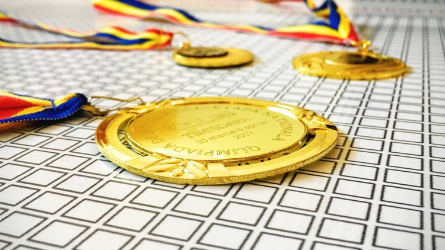

  

# Introduction to Algorithms and Data structures in C++

- **Instructors**: Andrei Margeloiu
- **Length**: 3 hr
- **Link**: https://www.udemy.com/introduction-to-algorithms-and-data-structures-in-c/
- **Resources**:
  - [Github | margiki/UdemyCourse](https://github.com/margiki/UdemyCourse)

# Course Content

- [Section 01 - Introduction](./Section%2001%20-%20Introduction)
- [Section 02 - Getting Started](./Section%2002%20-%20Getting%20Started)
- [Section 03 - Building a Strong Foundation](./Section%2003%20-%20Building%20a%20Strong%20Foundation)
- [Section 04 - Dynamic Programming](./Section%2004%20-%20Dynamic%20Programming)
- [Section 05 - Becoming a PRO](./Section%2005%20-%20Becoming%20a%20PRO)

# Project Demo

# Review
