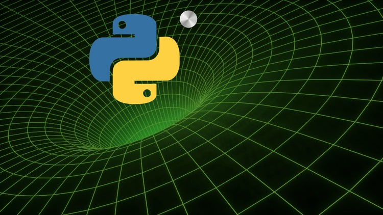

  

# Vim Masterclass

- **Instructors**: Fred Baptiste
- **Length**: 44.5 hr
- **Link**: [Udemy | Python 3: Deep Dive (Part 1)](https://www.udemy.com/python-3-deep-dive-part-1/)
- **Resources**: 
  - [GitHub | fbaptiste/python-deepdive](https://github.com/fbaptiste/python-deepdive)

# Course Content

- [Section 01 - Introduction]()
- [Section 02 - A Quick Refresher - Basics Review]()
- [Section 03 - Variables and Memory]()
- [Section 04 - Numeric Types]()
- [Section 05 - Function Parameters]()
- [Section 06 - First-Class Functions]()
- [Section 07 - Scopes, Closures and Decorators]()
- [Section 08 - Tuples as Data Structures and Named Tuples]()
- [Section 09 - Modules, Packages and Namespaces]()
- [Section 10 - Extras]()

# Project Demo

# Review
