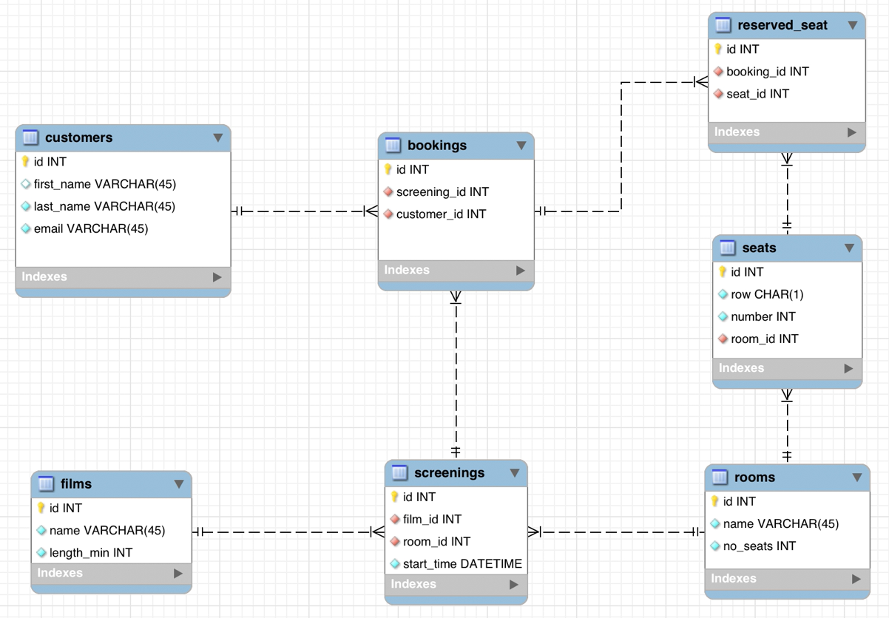

# Creating a Cinema Booking System Database

## [Lecture] Database Schema

<p align="center">
  
</p>

```sql
CREATE DATABASE cinema_booking_system;
USE cinema_booking_system;
```

## [Lecture] Create Films Table

```sql
CREATE TABLE film (
  id INT PRIMARY KEY AUTO_INCREAMENT,
  name VARCHAR(45) NOT NULL UNIQUE,
  length_min INT NOT NULL
);
```

## [Lecture] Create Customers Table

```sql
CREATE TABLE customers (
  id INT PRIMARY KEY AUTO_INCREMENT,
  first_name VARCHAR(45),
  last_name VARCHAR(45) NOT NULL,
  email VARCHAR(45) NOT NULL UNIQUE
);
```

## [Lecture] Create Rooms Table

```sql
CREATE TABLE rooms (
  id INT PRIMARY KEY AUTO_INCREMENT,
  name VARCHAR(45) NOT NULL,
  no_seats INT NOT NULL
);
```

## [Lecture] Create Screenings Table

```sql
CREATE TABLE screenings (
  id INT PRIMARY KEY AUTO_INCREMENT,
  film_id INT NOT NULL,
  room_id INT NOT NULL,
  start_time DATETIME NOT NULL,
  FOREIGN KEY (film_id) REFERENCES films(id),
  FOREIGN KEY (room_id) REFERENCES rooms(id)
);
```

## [Lecture] Create Seats Table

```sql
CREATE TABLE seats (
  id INT PRIMARY KEY AUTO_INCREMENT,
  row CHAR(1) NOT NULL,
  number INT NOT NULL,
  room_id INT NOT NULL,
  FOREIGN KEY (room_id) REFERENCES rooms(id)
)ㄤ
```

## [Lecture] Create Bookings Table

```sql
CREATE TABLE bookings (
  id INT PRIMARY KEY AUTO_INCREMENT,
  screening_id INT NOT NULL,
  customer_id INT NOT NULL,
  FOREIGN KEY (screening_id) REFERENCES screenings(id),
  FOREIGN KEY (customer_id) REFERENCES customers(id)
);
```

## [Lecture] Create Reserved_Seat Table

```sql
CREATE TABLE reserved_seat (
  id INT PRIMARY KEY AUTO_INCREMENT,
  booking_id INT NOT NULL,
  seat_id INT NOT NULL,
  FOREIGN KEY (booking_id) REFERENCES bookings(id),
  FOREIGN KEY (seat_id) REFERENCES seats(id)
);
```